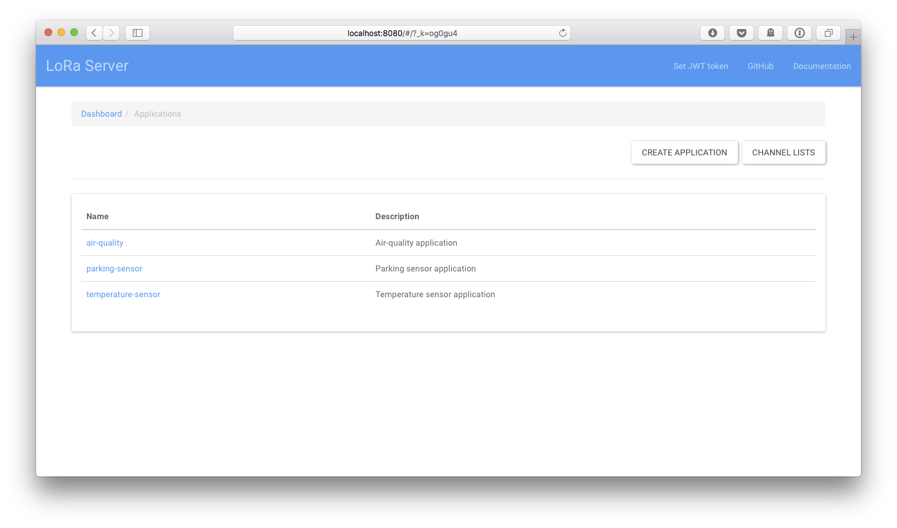
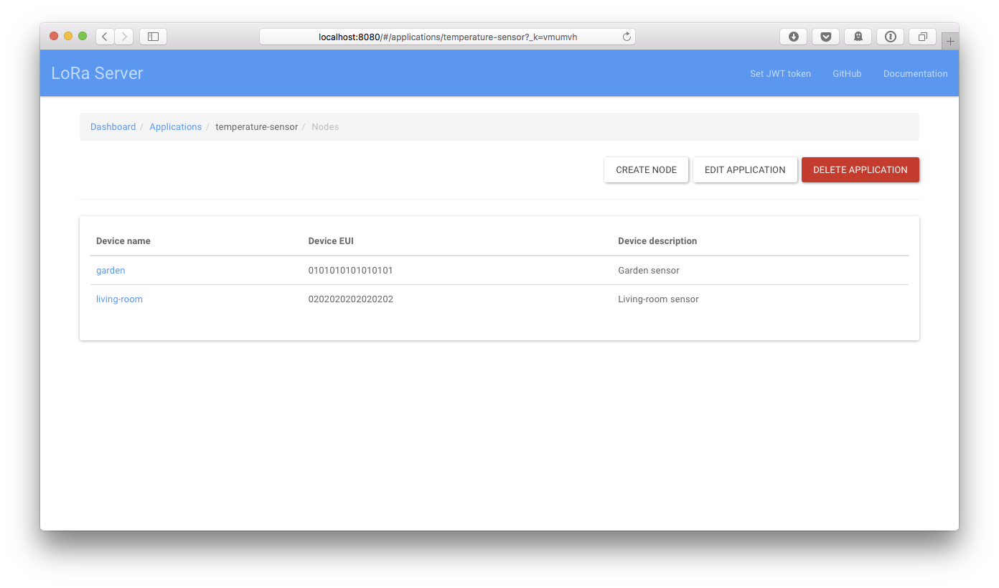
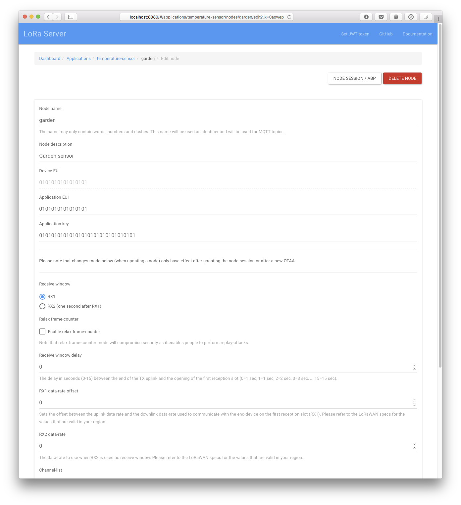
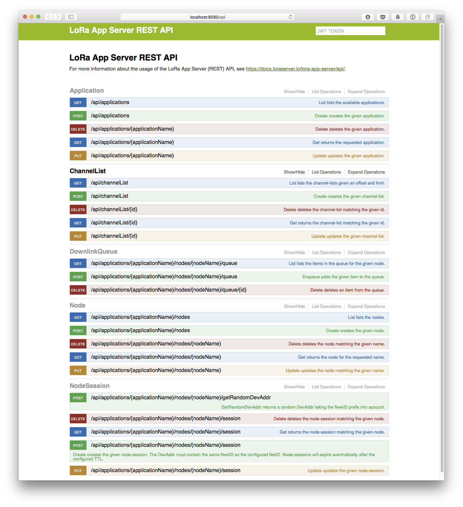

# LoRa App Server documentation

LoRa App Server is an open-source LoRaWAN application-server, compatible
with [LoRa Server](https://github.com/brocaar/loraserver). It is responsible
for the node "inventory" part of a LoRaWAN infrastructure, handling of received
application payloads and the downlink application payload queue. It comes
with a web-interface and API (RESTful JSON and gRPC) and supports authorization
by using JWT tokens (optional). Received payloads are published over MQTT
and payloads can be enqueued by using MQTT or the API.

## Screenshots






## Downloads

* Pre-compiled binaries are available at the [releases](https://github.com/brocaar/lora-app-server/releases) page:

	* Linux (including ARM / Raspberry Pi)
	* OS X
	* Windows

* Debian and Ubuntu packages are available at [https://repos.loraserver.io](https://repos.loraserver.io/).
* Source-code can be found at [https://github.com/brocaar/lora-app-server](https://github.com/brocaar/lora-app-server).

## Building from source

The easiest way to get started is by using the provided 
[docker-compose](https://docs.docker.com/compose/) environment. To start a bash
shell within the docker-compose environment, execute the following command from
the root of this project:

```bash
docker-compose run --rm appserver bash
```

A few example commands that you can run:

```bash
# run the tests
make test

# compile
make build

# cross-compile for Linux ARM
GOOS=linux GOARCH=arm make build

# cross-compile for Windows AMD64
GOOS=windows BINEXT=.exe GOARCH=amd64 make build

# build the .tar.gz file
make package

# build the .tar.gz file for Linux ARM
GOOS=linux GOARCH=arm make package

# build the .tar.gz file for Windows AMD64
GOOS=windows BINEXT=.exe GOARCH=amd64 make package
```

Alternatively, you can run the same commands from any working
[Go](https://golang.org/) environment. As all requirements are vendored,
there is no need to `go get` these. Make sure you have Go 1.7.x installed
and that you clone this repository to
`$GOPATH/src/github.com/brocaar/lora-app-server`.

## Contributing

There are a couple of ways to get involved:

* Join the discussions and share your feedback at [https://gitter.io/loraserver/lora-app-server](https://gitter.io/loraserver/lora-app-server)
* Report bugs or make feature-requests by opening an issue at [https://github.com/brocaar/lora-app-server/issues](https://github.com/brocaar/lora-app-server/issues)
* Fix issues or improve documentation by creating pull-requests

When you would like to add new features, please discuss the feature first
by creating an issue describing your feature, how you're planning to implement
it, what the usecase is etc...

## License

LoRa App Server is distributed under the MIT license. See also
[LICENSE](https://github.com/brocaar/lora-app-server/blob/master/LICENSE).
